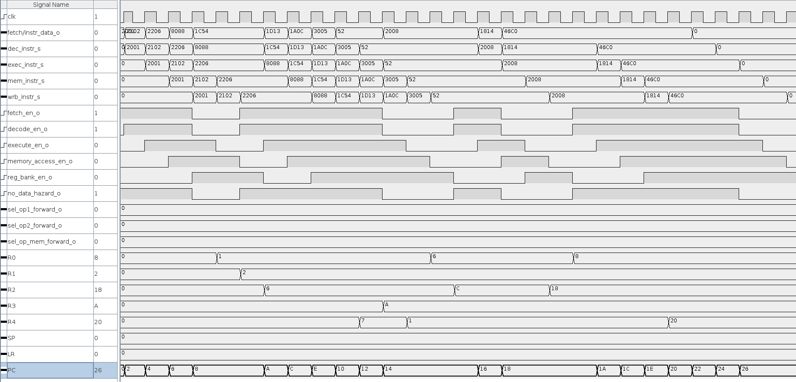
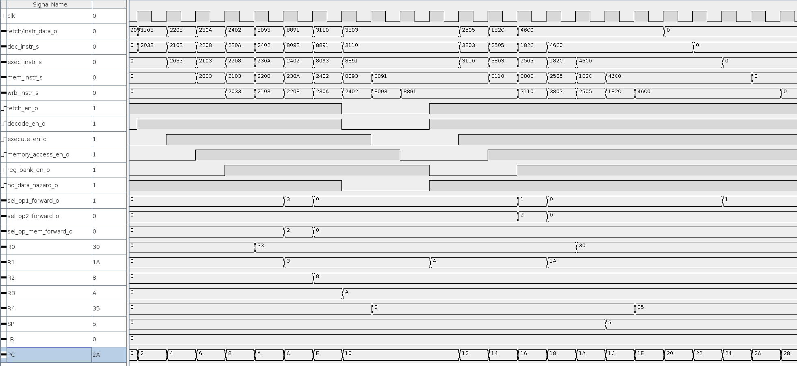

# Rapport ARO-Lab6

## Programme 1

**hazard_detection_mode On:**

**hazard_detection_mode Off:**

## Programme 2

**hazard_detection_mode On:**

**hazard_detection_mode Off:**

## Programme 3

**hazard_detection_mode On:**

**hazard_detection_mode Off:**

## Question 1

**hazard_detection_mode On:**

**hazard_detection_mode Off:**

## Question 2

**hazard_detection_mode On:**

.png)

**hazard_detection_mode Off:**

.png)

## Question 3

$17 \text{ instructions, } 26 \text{ cycles => IPC = } 17 / 26 = 0.65 \text{ instructions par cycles}$

## Question 4

$17 \text{ instructions, } 20 \text{ cycles => IPC = } 17 / 20 = 0.85 \text{ instructions par cycles}$

## Question 5

Sans la détection des aléas de données, le processeur exécute les instructions sans insérer de bulles pour gérer les dépendances de donées. On utilise le forwarding pour transmettre les résultats intermédiaires entre les étapes. Donc si une donnée dépend d'une valeur pas encore disponible, l'aléa n'est pas détecté et peut produire un résultat erroné.

Avec la détection des aléas de données, le processeur peut détecter les dépendances de données. Quand une est détecté, il insère automatiquement des `NOP` pour attendre que la donnée dsoit prête.

## Question 6
**hazard_detection_mode On:**

## Question 7

L'arrêt est causé par la dépendance entre l'instruction `LDRH r1, [r2, #4]` et `add r1,#0x10`. Comme le résultat d'une instruction mémoire ne peut pas être forwardé immédiatement, des `NOP` sont inséré pour attendre que le chargement soit terminé.

## Question 8

Une valeur `0` signifie que la donnée vient directement de la banque de registres. Une valeur `1`, `2`, ou `3` indique que la données est forwardée: 
- `1` -> depuis `Execute`, 
- `2` -> depuis `Memory Access`
- `3` -> depuis `Write Back`

.png)

## Question 9

Il sert à indiquer si l'instruction en cours est une instruction de type mémoire. Avec `sel_mem_i`, le processeur peut détecter qu'il ne doit pas appliquer de forwarding immédiat et doit insérer des `NOP` à la place pour attendre la fin de l'accès mémoire. Il garantit que seules des données dvalidés sont utilisées dans le pipeline.

## Question 10

Oui, il est nécessaire de faire du ddata forwarding depuis le stage `WRITE_BACK`. Certaines instructions ne produisent les résultats qu'après l'accès mémoire et donc à l'étape `WRITE_BACK`. Sans forwarding, les instructions dépendantes devraient attendre des cycles supplémentaires. Cela permet donc d'accélérer l'exécution en réduisant les temps d'attente.

## Question 11

- Une dépendance de données doit exister
- L'instruction précédente doit produire une valeur valide
- Le résultat doit être disponible dans une étape du pipeline (`EX`, `MEM` ou `WB`)
- Pour les opérations mémoire, on doit attendre que l'accès mémoire soit terminé avant de pouvoir forwarder la valeur
- Pas de risque de conflit d'écriture entre plusieurs instructions

## Question 12

- Avantages: réduction des trous et amélioration du débit d'instructions, résolution dynamique des dépendances de données
- Inconvénients: plus complexe à implémenter, certaines dépendances (après un `LOAD`) ne peuvent pas être résolues immédiatement 

## Question 13

Les signaux `sel_opX_forward_s` permet de sélectionner dynamiquement la source des opérandes dans le circuit `Execute`. Grâce à ça, le processeur peut choisir d'utiliser soit les valeurs provenant directement de la banque de registres, soit des valeurs forwardées. 

## Question 14

Il permet de synchroniser les données mémoire avec le pipeline. Cela garantit que les données arrivent au bon moment.
